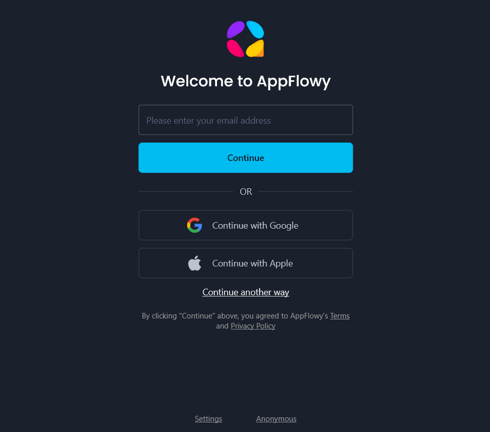
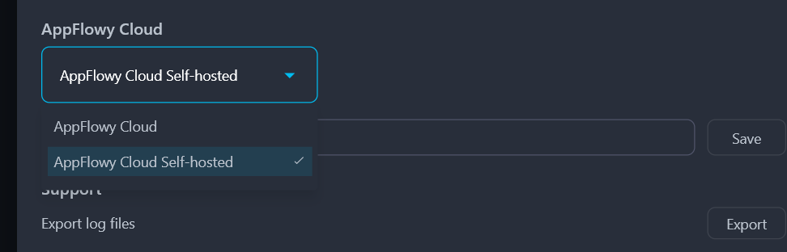
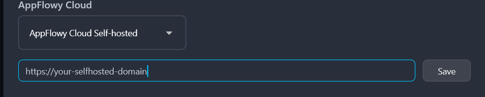

# AppFlowy CI/CD pipeline

Deploy AppFlowy server with CI/CD on Elestio

 
 

# Once deployed ...

You can open AppFlowy Cloud here:

    URL: https://[CI_CD_DOMAIN]
    login: "[ADMIN_EMAIL]"
    password: "[ADMIN_PASSWORD]"

You can open pgAdmin here:

    URL: https://[CI_CD_DOMAIN]/pgadmin
    login: "[ADMIN_EMAIL]"
    password: "[ADMIN_PASSWORD]"

You can open Portainer here:

    URL: https://[CI_CD_DOMAIN]/portainer
    login: "admin"
    password: "[ADMIN_PASSWORD]"

You can open Minio here:

    URL: https://[CI_CD_DOMAIN]/minio
    login: "root"
    password: "[ADMIN_PASSWORD]"

# AppFlowy Cloud - User Guide

## Features Under Development

Sharing and Publishing:
At the moment, you cannot share or publish content. This feature is being actively worked on.
<a href="https://github.com/AppFlowy-IO/AppFlowy-Cloud/issues/873#issuecomment-2417012163">Issue #873 on GitHub</a>

User Invitations:
Inviting users through the application is not yet available. This feature is also in progress.
<a href="https://github.com/AppFlowy-IO/AppFlowy-Cloud/issues/873#issuecomment-2417012163">Issue #873 on GitHub</a>

## Prerequisites

To use AppFlowy Cloud, you need to download the latest release package from:
<a href="https://github.com/AppFlowy-IO/AppFlowy/releases">AppFlowy Releases</a>

After downloading, follow the installation instructions.

## Application Setup

### Step 1: Open Settings

Once the application is installed, launch it. On the main page, click "Settings" at the bottom of the window.

### Step 2: Configure AppFlowy Cloud

In the AppFlowy Cloud section, open the dropdown menu and select "AppFlowy Cloud Self Hosted".

### Step 3: Enter the URL

Input the following URL:

    https://[CI_CD_DOMAIN]

Then, click "Save" to apply the changes.

## Login

You can now log in using your credentials.
